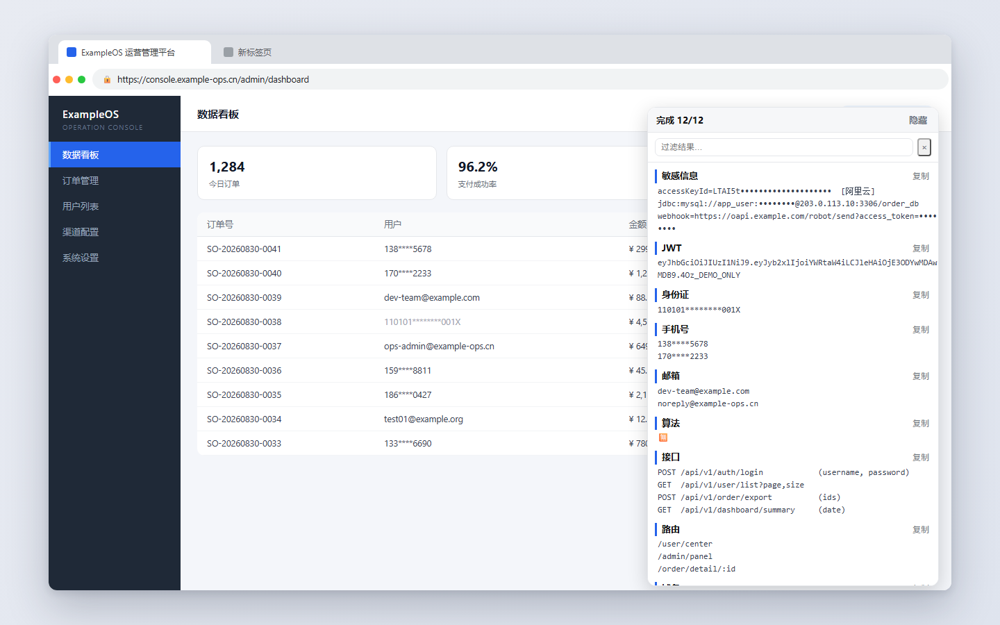

# InfoHunter

  

InfoHunter 是一款**被动式**信息提取浏览器扩展：浏览网页时自动从页面源码与 JS 中挖掘敏感信息、接口语义、路由与密钥，全部在本地完成。运行时观测只记录页面本来就会发生的事，**不发起任何探测请求**——刻意不实现「探测不存在路径」的能力，避免在目标侧被判定为扫描行为。

## 功能

**静态提取 —— 20 类结果**

- 敏感信息 / JWT / 身份证 / 手机号 / 邮箱 / 算法 / 接口 / 路由 / 域名 / IP加端口 / IP / URL / PATH / IncompletePath / StaticPath / Sourcemap
- **凭据结构化**：按厂商前缀归类（阿里云 `LTAI`、腾讯云 `AKID`、AWS `AKIA`、GitHub `gh*`、PEM 私钥、`jdbc:` / `mongo://` 连接串等），附 high / medium / low 可信度
- **JWT 风险标记**：解码后标 `alg=none`、对称签名、无 `exp`、payload 含 `admin` / `role` 等权限字段
- **接口语义还原**：识别 `axios.post('/x', {id})`、`request({url,method,data})`、`fetch()` 等调用，产出 `method + path + 参数名`
- **Sourcemap 全链路**：发现 `.js.map` → 拉取 → 还原原始源码路径与内容 → 二次提取

**框架运行时分析**（MAIN world，零请求）

- Vue2/3、Next.js（Pages + App Router RSC）、Nuxt 2/3、React Router v6、webpack chunk 清单

**运行时观测面**（全部零请求，被动记录）

- **真实请求**：页面实际发出的 XHR / fetch 地址、method 与查询参数名
- **响应体旁观**：页面自己读取 fetch/XHR 响应的那一刻旁观数据，接口 JSON 里的手机号 / 邮箱 / 凭据直接进结果（含业务字段降噪与轮询去重）
- **端点**：WebSocket / SSE / Worker
- **存储键名**：Web Storage / cookie 键名，值再过一遍规则库
- **参数名**：从真实请求 URL 里抠出的查询参数
- **SPA 增量补扫**：路由切换后懒加载的 chunk 也补抓

**结果交互**

- 分类计数、实时搜索、作用域过滤、来源溯源、页面内悬浮结果面板；4 种导出（JSON / CSV / URL 列表 / 路径列表）

## 安装

未上架任何商店，以「加载已解压的扩展程序」方式安装：

1. 下载本仓库：`git clone` 本项目，或 **Code → Download ZIP** 后解压
2. Chrome 打开 `chrome://extensions/`，右上角开**开发者模式**
3. 点**加载已解压的扩展程序**，选择本仓库目录（`manifest.json` 所在层）
4. manifest 未内置 `key`：此方式下扩展 ID 由目录路径哈希决定，换目录或换机器 ID 会变，`chrome.storage` 里的历史数据不跟随

## 请求边界

| 行为 | 默认 | 风险 |
|---|---|---|
| 抓取页面引用的 JS | 开 | 极低 |
| 抓 `.js.map` | 开（设置页可关） | 低 |
| JS 递归 depth 2 | **关**（需显式开启） | 中 |
| 记录页面已发出的请求 | 开 | **零**（不发起任何请求） |
| 旁观页面读到的响应体 | 开 | **零**（数据已下载完成，只是记录） |
| 运行时钩子（fetch/XHR/端点/存储） | 开 | **零** |
| SPA 懒加载补抓 | 开（每批 20 个） | 低 |
| 探测不存在的路径 | **未实现** | — |

## 许可

GPL-3.0，详见 [`LICENSE`](LICENSE)。
